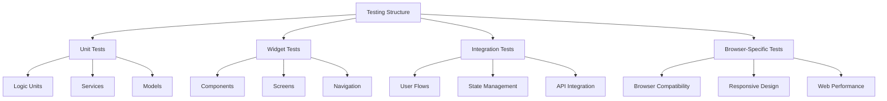

# Test-Driven Development (TDD) Strategy

## 1. Testing Layer Structure



## 2. Implementation Strategy

### 2.1 Project Structure
```
app/
├── test/
│   ├── unit/
│   │   ├── models/
│   │   ├── services/
│   │   └── utils/
│   ├── widget/
│   │   ├── components/
│   │   └── screens/
│   └── integration/
│       ├── flows/
│       └── web/
├── integration_test/
│   ├── app_test.dart
│   └── web_test.dart
└── test_driver/
    └── integration_test.dart
```

### 2.2 Required Testing Dependencies
```yaml
dev_dependencies:
  flutter_test:
    sdk: flutter
  integration_test:
    sdk: flutter
  mockito: ^5.4.4
  flutter_driver:
    sdk: flutter
  test: ^1.24.9
```

## 3. Testing Approach

### 3.1 Unit Tests
- Models (meditation sessions, user preferences)
- Services (timer, audio, analytics)
- Utilities (formatters, validators)

### 3.2 Widget Tests
- Individual UI components
- Screen layouts
- User interactions
- State management

### 3.3 Integration Tests
- Complete meditation flows
- User journey scenarios
- Data persistence
- State transitions

### 3.4 Browser-Specific Tests
- Chrome/Firefox/Safari compatibility
- Responsive design breakpoints
- Web-specific features (audio, storage)
- Performance metrics

## 4. Implementation Phases

1. **Phase 1: Basic Testing Infrastructure**
   - Set up testing directories
   - Configure test runners
   - Create first test examples
   - Implement CI pipeline setup

2. **Phase 2: Core Feature Tests**
   - Meditation timer tests
   - Session management tests
   - User preferences tests
   - Basic UI component tests

3. **Phase 3: Web-Specific Tests**
   - Browser compatibility tests
   - Responsive design tests
   - Performance benchmarks
   - Web storage tests

4. **Phase 4: Integration & E2E**
   - Complete user flow tests
   - Cross-browser testing
   - State management tests
   - API integration tests

## 5. Browser Testing Configuration

### 5.1 Test Runner Setup
```dart
// integration_test/web_test.dart
void main() {
  IntegrationTestWidgetsFlutterBinding.ensureInitialized();

  group('Browser Tests', () {
    testWidgets('Responsive Layout Test', ...);
    testWidgets('Audio Controls Test', ...);
    testWidgets('Storage Persistence Test', ...);
  });
}
```

### 5.2 Test Execution Commands
```bash
# Unit and Widget Tests
flutter test

# Integration Tests (Chrome)
flutter drive \
  --driver=test_driver/integration_test.dart \
  --target=integration_test/app_test.dart \
  -d chrome

# Web-specific Tests
flutter drive \
  --driver=test_driver/integration_test.dart \
  --target=integration_test/web_test.dart \
  -d chrome
```

## 6. Best Practices

1. **Test Organization**
   - Group related tests together
   - Use descriptive test names
   - Follow the Arrange-Act-Assert pattern
   - Keep tests independent and isolated

2. **Web Testing Considerations**
   - Test on multiple browsers
   - Verify responsive layouts
   - Check web-specific APIs
   - Monitor performance metrics

3. **Code Coverage**
   - Aim for high test coverage
   - Focus on critical paths
   - Include edge cases
   - Regular coverage monitoring

4. **Continuous Integration**
   - Automated test runs
   - Browser matrix testing
   - Performance benchmarking
   - Regular dependency updates