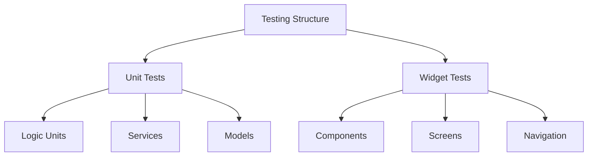

# Test-Driven Development (TDD) Strategy

## 1. Testing Layer Structure



## 2. Implementation Strategy

### 2.1 Project Structure
```
app/
├── test/
│   ├── unit/
│   │   ├── models/
│   │   ├── services/
│   │   └── utils/
│   └── widget/
│       ├── components/
│       └── screens/
```

### 2.2 Required Testing Dependencies
```yaml
dev_dependencies:
  flutter_test:
    sdk: flutter
  mocktail: ^1.0.4
  test: ^1.25.8
```

## 3. Testing Approach

### 3.1 Unit Tests
- Models (meditation sessions, user preferences)
- Services (timer, audio, analytics)
- Utilities (formatters, validators)

### 3.2 Widget Tests
- Individual UI components
- Screen layouts
- User interactions
- State management

## 4. Implementation Phases

1. **Phase 1: Basic Testing Infrastructure**
   - Set up testing directories
   - Configure test runners
   - Create first test examples

2. **Phase 2: Core Feature Tests**
   - Meditation timer tests
   - Session management tests
   - User preferences tests
   - Basic UI component tests

## 5. Best Practices

1. **Test Organization**
   - Group related tests together
   - Use descriptive test names
   - Follow the Arrange-Act-Assert pattern
   - Keep tests independent and isolated

2. **Code Coverage**
   - Aim for high test coverage
   - Focus on critical paths
   - Include edge cases
   - Regular coverage monitoring

3. **Continuous Integration**
   - Automated test runs
   - Regular dependency updates
   - Test result tracking
