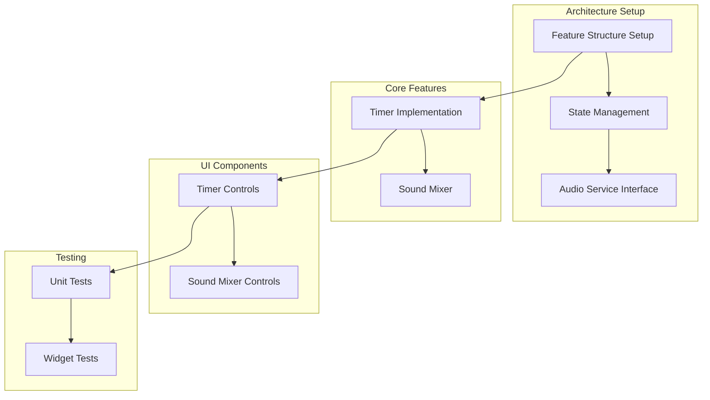

# Basic Meditation Tools Implementation Plan

## Overview
Implementation plan for the Basic Meditation Tools feature, focusing on essential meditation functionality: timer and ambient sound mixer.

## Implementation Checkpoints

### Checkpoint 1: Core Implementation with Mocks
- Create test structure
- Implement models (meditation session, ambient sound settings)
- Create service interfaces
- Implement mock services
- Build UI components with mock data
- Complete widget tests
- Success Criteria:
  * All tests passing
  * UI fully functional with mock data
  * Proper state management

### Checkpoint 2: Timer Service Implementation
- Implement timer service
- Handle app lifecycle changes
- Add unit tests for timer service
- Success Criteria:
  * Timer works in foreground/background
  * Accurate time tracking
  * Proper state persistence
  * All tests passing

### Checkpoint 3: Audio Service Implementation
- Implement audio service using standard audio packages
- Background audio playback
- Add unit tests for audio service
- Success Criteria:
  * Smooth audio playback
  * Individual volume controls working
  * Background audio working
  * All tests passing

## Architecture



## Directory Structure
```
lib/
  ├── features/
  │   └── meditation/
  │       ├── bloc/
  │       │   ├── meditation_bloc.dart
  │       │   ├── meditation_event.dart
  │       │   └── meditation_state.dart
  │       ├── models/
  │       │   ├── meditation_session.dart
  │       │   └── ambient_sound_settings.dart
  │       ├── repository/
  │       │   └── meditation_repository.dart
  │       ├── services/
  │       │   ├── timer_service.dart
  │       │   └── audio_service.dart
  │       └── views/
  │           ├── meditation_screen.dart
  │           ├── timer_controls.dart
  │           └── sound_mixer_controls.dart
  └── shared/
      └── audio/
          └── audio_player.dart

test/
  └── features/
      └── meditation/
          ├── bloc/
          │   └── meditation_bloc_test.dart
          ├── services/
          │   ├── timer_service_test.dart
          │   └── audio_service_test.dart
          └── widget/
              ├── meditation_screen_test.dart
              ├── timer_controls_test.dart
              └── sound_mixer_controls_test.dart
```

## Component Details

### Models
- MeditationSession
  * duration
  * currentTime
  * status (running, paused, completed)
  * Map<AmbientSound, AmbientSoundSettings> ambientSounds

- AmbientSound
  * id
  * name
  * assetPath

- AmbientSoundSettings
  * isActive
  * volume (0.0 to 1.0)

### Services
- TimerService Interface
  * start(Duration duration)
  * pause()
  * resume()
  * stop()
  * getTimeLeft()
  * Stream<Duration> timeStream

- AudioService Interface
  * toggleSound(String soundId, bool active)
  * setVolume(String soundId, double volume)
  * getCurrentSoundSettings()
  * Stream<Map<String, AmbientSoundSettings>> soundSettingsStream

### UI Components
- Timer Controls
  * Duration selector
  * Start/Pause/Resume buttons
  * Time display
  * Progress indicator

- Sound Mixer Controls
  * Available sounds list/grid
  * Individual volume sliders
  * Sound toggle controls

## Technical Considerations

### Timer Service
- App lifecycle management
- State persistence

### Audio Service
- Background playback
- Audio session management
- State persistence for active sounds

### Testing Strategy
- Unit tests for all services
- Widget tests for UI components
- Mock implementations for development

## Success Criteria
- All tests passing at each checkpoint
- Timer functions accurately in all states
- Multiple ambient sounds play together
- Individual volume controls work
- All features work in background mode
- UI responds smoothly to user interaction
- State properly persists across app restarts