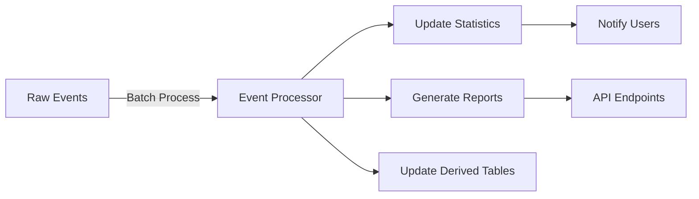

# Core Progress Tracking - MVP Specification

## Overview
This document outlines the implementation specifications for the Core Progress Tracking feature in the Meditation Companion app. The system will track all user interactions and app events, storing them in Supabase for later processing and analysis.

## Goals
- Track all user interactions and app events
- Store raw event data in Supabase
- Enable server-side processing for reports and analytics
- Maintain flexible and expandable event tracking system
- Ensure data quality for analysis

## Data Models

### AppSession
```dart
class AppSession {
  final String id;                    // Unique session identifier
  final String deviceId;              // Associated device ID
  final String userId;                // Associated user ID
  final DateTime startTime;           // Session start time
  final DateTime? endTime;            // Session end time (null if active)
  final String deviceInfo;            // Device information
  final String appVersion;            // App version
  final Map<String, dynamic> metadata;// Additional session metadata
}
```

### Event Structure

```dart
class BaseEvent {
  final String id;                    // Unique event identifier
  final String sessionId;             // Associated AppSession ID
  final String userId;                // Associated user ID
  final DateTime timestamp;           // When the event occurred
  final String eventType;             // Type of event
}

/// Example Event Types and Their Parameters:

// App Session Events
class AppSessionStartEvent extends BaseEvent {
  final String deviceId;              // Device ID
  final String appVersion;            // App version
}
class AppSessionEndEvent extends BaseEvent {
  final String? deviceId;             // Device ID
  final String? appVersion;           // App version
}

// Auth Events
class UserLoginEvent extends BaseEvent {
  final String userId;                // User ID
  final String authMethod;            // 'email', 'google', etc.
}
class UserLogoutEvent extends BaseEvent {
  final String userId;                // User ID
}

// Meditation Events
class MeditationStartEvent extends BaseEvent {
  final String meditationId;          // Unique meditation session ID
  final Duration plannedDuration;     // Planned session duration
}

class MeditationEndEvent extends BaseEvent {
  final String meditationId;          // Links to start event
  final String completionType;        // 'completed' or 'interrupted'
}

// Audio Events
class AudioVolumeEvent extends BaseEvent {
  final String? meditationId;          // Current meditation if any
  final String soundId;               // Specific sound identifier
  final double volume;                // New volume level
}

class AudioToggleEvent extends BaseEvent {
  final String? meditationId;          // Current meditation if any
  final String soundId;               // Sound being toggled
  final bool isActive;                // New state
}

// Error Events
class ErrorEvent extends BaseEvent {
  final String errorCode;             // Error identifier
  final String? meditationId;          // Affected meditation if any
  final String component;             // Component where error occurred
}

// UI Events
class ScreenViewEvent extends BaseEvent {
  final String screenName;            // Screen being viewed
  final String? meditationId;         // Related meditation if any
}

class ButtonClickEvent extends BaseEvent {
  final String buttonId;              // Button identifier
  final String screenName;            // Screen containing button
  final String? meditationId;         // Related meditation if any
}
```


## Supabase Table Structure

```sql
-- App Sessions
create table app_sessions (
  id uuid primary key default uuid_generate_v4(),
  user_id uuid references auth.users not null,
  start_time timestamp with time zone not null,
  end_time timestamp with time zone,
  device_info text not null,
  app_version text not null,
  created_at timestamp with time zone default now()
);

-- Events Base Table
create table events (
  id uuid primary key default uuid_generate_v4(),
  session_id uuid references app_sessions not null,
  user_id uuid references auth.users not null,
  timestamp timestamp with time zone not null,
  event_type text not null,
  created_at timestamp with time zone default now()
);

-- Event Parameters (Normalized)
create table event_parameters (
  event_id uuid references events not null,
  param_name text not null,
  param_value text not null,
  primary key (event_id, param_name)
);


## Technical Implementation

### Event Processing Pipeline


## Feature Requirements

### 1. Event Tracking
- [x] Track all user interactions
- [x] Capture app session data
- [x] Record meditation events
- [x] Monitor audio settings changes
- [x] Handle offline events

### 2. Data Management
- [x] Efficient local queue system
- [x] Batch uploading to Supabase
- [x] Retry mechanism for failed uploads
- [x] Data validation before storage
- [x] Cleanup of processed events

### 3. Processing & Analytics
- [x] Server-side event processing
- [x] Real-time statistics updates
- [x] Report generation
- [x] Data aggregation
- [x] Trend analysis

## Technical Considerations

### Local Storage
- Queue system for offline operation
- Batch processing for efficiency
- Data compression if needed
- Storage limits and cleanup

### Network Handling
- Automatic retry for failed uploads
- Batch size optimization
- Network status monitoring
- Upload scheduling

### Privacy & Security
- Data encryption in transit
- Secure storage practices
- User data isolation
- Clear data retention policies
- GDPR compliance measures

## Success Criteria
- [ ] All events captured accurately
- [ ] Efficient data upload to Supabase
- [ ] Successful offline operation
- [ ] Accurate event processing
- [ ] Reliable statistics generation
- [ ] Acceptable app performance
- [ ] Data consistency maintained

## Testing Strategy
1. Unit tests for event tracking
2. Integration tests with Supabase
3. Offline capability tests
4. Performance testing
5. Data consistency verification

## Implementation Timeline
- Event system architecture: 3 days
- Supabase setup: 2 days
- Event tracking implementation: 4 days
- Processing pipeline: 3 days
- Testing & refinement: 3 days

## Future Enhancements
- Real-time analytics dashboard
- Advanced event correlations
- Machine learning integration
- Custom event definitions
- Enhanced reporting tools