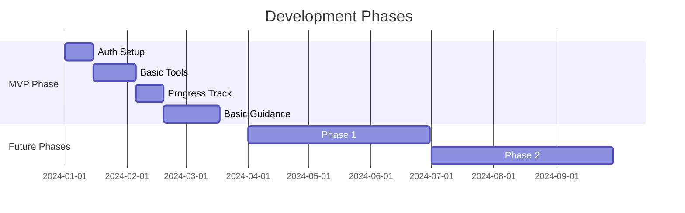

# Meditation Companion Development Roadmap

## Project Phases Overview

## MVP Phase - Core Meditation Experience
Focus on delivering essential meditation features and basic guidance system.

### 1. User Authentication Setup
- **Story Points**: 5
- **Complexity**: Medium
- **Dependencies**: None
- **Implementation Concerns**:
  - Secure authentication flow
  - Cross-platform compatibility
  - Token management
  - Offline capabilities
  - GDPR compliance

Features:
- User registration and login
- Password reset functionality
- Session management
- Basic profile management
- Secure token storage

### 2. Basic Meditation Tools
- **Story Points**: 5
- **Complexity**: Low
- **Dependencies**: None
- **Implementation Concerns**: 
  - Clean architecture setup
  - Cross-platform audio handling
  - Basic UI/UX design system

Features:
- Simple guided breathing exercises
- Basic timer with gentle alerts
- Fundamental ambient sounds
- Essential meditation instructions

### 3. Core Progress Tracking
- **Story Points**: 3
- **Complexity**: Low
- **Dependencies**: Basic Meditation Tools, User Authentication Setup
- **Implementation Concerns**:
  - Local data persistence
  - Basic analytics implementation
  - Privacy considerations

Features:
- Session duration tracking
- Basic meditation stats
- Simple progress visualizations
- Session history

### 4. Basic Interactive Guidance
- **Story Points**: 8
- **Complexity**: Medium
- **Dependencies**: Basic Meditation Tools, User Authentication Setup
- **Implementation Concerns**:
  - Voice processing system architecture
  - Real-time feedback mechanisms
  - Error handling for voice interactions

Features:
- Simple voice commands
- Basic session customization
- Foundational guidance algorithms
- Essential feedback system

## Phase 1 - Enhanced Experience

### 1. Advanced Meditation Tools
- **Story Points**: 8
- **Complexity**: Medium
- **Dependencies**: MVP Meditation Tools
- **Implementation Concerns**:
  - Advanced audio processing
  - Performance optimization
  - Content management system

Features:
- Advanced breathing techniques
- Custom ambient sound mixer
- Multiple meditation techniques
- Expanded guidance content

### 2. Enhanced Progress Tracking
- **Story Points**: 5
- **Complexity**: Medium
- **Dependencies**: Core Progress Tracking
- **Implementation Concerns**:
  - Data visualization optimization
  - Analytics expansion
  - Cloud sync architecture

Features:
- Detailed meditation metrics
- Progress insights
- Achievement system
- Advanced statistics

### 3. Personalization System
- **Story Points**: 13
- **Complexity**: High
- **Dependencies**: Enhanced Progress Tracking
- **Implementation Concerns**:
  - AI model integration
  - User preference management
  - Performance impact
  - Data privacy

Features:
- AI-driven recommendations
- Adaptive difficulty scaling
- Personal goal setting
- Custom meditation paths

## Phase 2 - Community & Advanced Features

### 1. Advanced Interactive Guidance
- **Story Points**: 13
- **Complexity**: High
- **Dependencies**: Basic Interactive Guidance, Personalization System
- **Implementation Concerns**:
  - Advanced AI integration
  - Real-time processing optimization
  - Scalability
  - Error recovery

Features:
- Advanced voice interaction
- Real-time adaptation
- Complex guidance patterns
- Personalized instruction style

### 2. Community Features
- **Story Points**: 8
- **Complexity**: Medium
- **Dependencies**: Enhanced Progress Tracking
- **Implementation Concerns**:
  - Backend service architecture
  - Real-time communication
  - Content moderation
  - Social features scaling

Features:
- Community challenges
- Progress sharing
- Social interactions
- Group meditations

## Technical Considerations

### Infrastructure Requirements
- Flutter state management solution
- Backend services for community features
- AI/ML pipeline for personalization
- Analytics and monitoring systems
- Content delivery network

### Security & Privacy
- User data encryption
- Privacy-first analytics
- GDPR compliance
- Secure authentication:
  - OAuth 2.0 implementation
  - Secure token management
  - Session timeout handling
  - Data isolation between users
  - Privacy policy compliance

### Performance Goals
- < 1s app launch time
- Smooth audio playback
- Real-time voice processing
- Efficient battery usage

## Success Metrics
- User retention rate
- Session completion rate
- User satisfaction scores
- Technical performance metrics
- Feature adoption rates